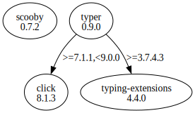

# Third Party Dependencies

<!--[[[fill sbom_sha256()]]]-->
The [SBOM in CycloneDX v1.4 JSON format](https://git.sr.ht/~sthagen/pilli/blob/default/sbom/cdx.json) with SHA256 checksum ([560dc893 ...](https://git.sr.ht/~sthagen/pilli/blob/default/sbom/cdx.json.sha256 "sha256:560dc893609e272b971718414695fff3e58e48797ab14db9cb518b852f6b7295")).
<!--[[[end]]] (checksum: 60712d056ecb55532cfa4ac292ca8b97)-->
## Licenses 

JSON files with complete license info of: [direct dependencies](direct-dependency-licenses.json) | [all dependencies](all-dependency-licenses.json)

### Direct Dependencies

<!--[[[fill direct_dependencies_table()]]]-->
| Name                                             | Version                                         | License     | Author                                                              | Description (from packaging data)                                  |
|:-------------------------------------------------|:------------------------------------------------|:------------|:--------------------------------------------------------------------|:-------------------------------------------------------------------|
| [scooby](https://github.com/banesullivan/scooby) | [0.7.2](https://pypi.org/project/scooby/0.7.2/) | MIT License | Dieter Werthmüller, Bane Sullivan, Alex Kaszynski, and contributors | A Great Dane turned Python environment detective                   |
| [typer](https://github.com/tiangolo/typer)       | [0.9.0](https://pypi.org/project/typer/0.9.0/)  | MIT License | Sebastián Ramírez                                                   | Typer, build great CLIs. Easy to code. Based on Python type hints. |
<!--[[[end]]] (checksum: d1f5c99e95b0e1cff426fbd7c92ae7a7)-->

### Indirect Dependencies

<!--[[[fill indirect_dependencies_table()]]]-->
| Name                                          | Version                                        | License     | Author         | Description (from packaging data)         |
|:----------------------------------------------|:-----------------------------------------------|:------------|:---------------|:------------------------------------------|
| [click](https://palletsprojects.com/p/click/) | [8.1.3](https://pypi.org/project/click/8.1.3/) | BSD License | Armin Ronacher | Composable command line interface toolkit |
<!--[[[end]]] (checksum: dc3a866a7aa3332404bde3da87727cb9)-->

## Dependency Tree(s)

JSON file with the complete package dependency tree info of: [the full dependency tree](package-dependency-tree.json)

### Rendered SVG

Base graphviz file in dot format: [Trees of the direct dependencies](package-dependency-tree.dot.txt)



### Console Representation

<!--[[[fill dependency_tree_console_text()]]]-->
````console
scooby==0.7.2
typer==0.9.0
├── click [required: >=7.1.1,<9.0.0, installed: 8.1.3]
└── typing-extensions [required: >=3.7.4.3, installed: 4.4.0]
````
<!--[[[end]]] (checksum: 268ef3b9765541d994e5d3f443e60a1d)-->
